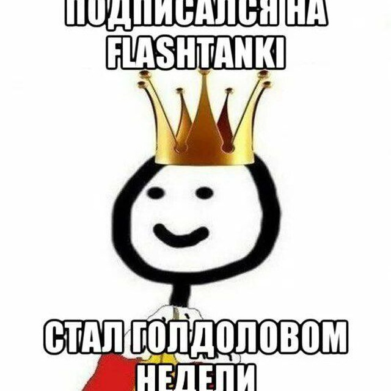

*Подписался на FlashTanki — стал голдоловом недели!*

# Flash-Tanki

> **⚠️ This is a fan-made, abandoned server project for the old Flash-based Tanki Online. No client included. Use for fun, learning, or nostalgia!**

---

**Flash-Tanki** — серверная часть фанатского проекта, вдохновленного Tanki Online и построенного на базе протокола ProTanki. Сервер написан на Kotlin, работает с Flash-клиентом (library.swf, не входит в репозиторий) и реализует основные механики старых "танков".

## Features / Особенности
- Бои, гараж, чаты, античит, квесты, бонусы, промокоды и многое другое
- Поддержка разных игровых режимов, карт, предметов
- Локализация: русский и английский языки (`src/main/resources/data/lang/`)
- Использует SQL-базу данных (см. `flashtanki.sql`)

## Быстрый старт
1. **Требования:**
   - Java 17+
   - Gradle (или `gradlew`/`gradlew.bat`)
   - Настроенная база данных (см. `flashtanki.sql`)
2. **Сборка и запуск:**
    ```sh
   ./gradlew shadowjar
   
   ./java -jar name-jar.jar
   ```
   Или запустите `Main.kt` через вашу IDE.
3. **Настройка:**
   - Конфиги и ресурсы: `src/main/resources/`
   - Локализация и карты: `src/main/resources/data/`
   - Пример строки подключения к БД (укажите в конфиге, если требуется):
     ```
     jdbc:mysql://localhost:3306/flashtanki?user=youruser&password=yourpass
     ```

## Структура репозитория
- `src/main/kotlin/flashtanki/server/` — серверная логика (бои, чаты, античит, команды, гараж и т.д.)
- `src/main/resources/data/` — игровые ресурсы, карты, локализации, промокоды
- `flashtanki.sql` — структура базы данных
- `build.gradle.kts` — сборка проекта

## FAQ
**Где взять клиент?**  
Клиент (library.swf) не входит в репозиторий. Ищите модифицированный Flash-клиент (ProTanki).

**Почему не работает?**  
Проект давно заброшен, библиотека клиента декомпилирована не полностью, возможны баги и несовместимости. Всё предоставляется "как есть".

**Можно ли использовать для своего проекта?**  
Да, но на свой страх и риск. Код открыт для изучения и доработок.

## Вклад и поддержка
Проект не поддерживается официально, но вы можете форкать, дорабатывать, экспериментировать. Если найдете клиента — делайте что-то, возможно, что-то даже получится!

## История и дисклеймер
Этот проект был создан небольшой группой энтузиастов "на коленке" ради интереса и экспериментов с протоколом ProTanki. Не предназначен для коммерческого использования.

**Автор:** Один из тех, кто делал этот проект.  
*Если у вас есть вопросы или вы хотите доработать проект — дерзайте! Удачи и приятного изучения исходников.*

---

> **English summary:**
> Flash-Tanki is a fan-made, Kotlin-based server for the old Flash Tanki Online game, using the ProTanki protocol. No client included. Abandoned, for fun and learning only.
